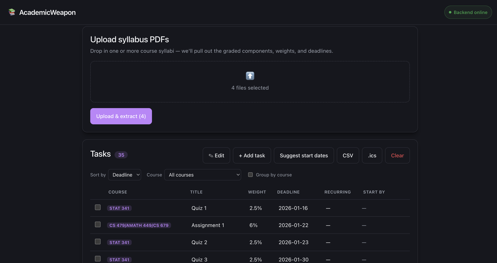
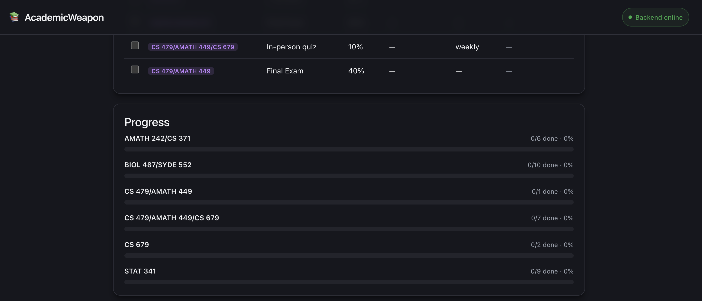
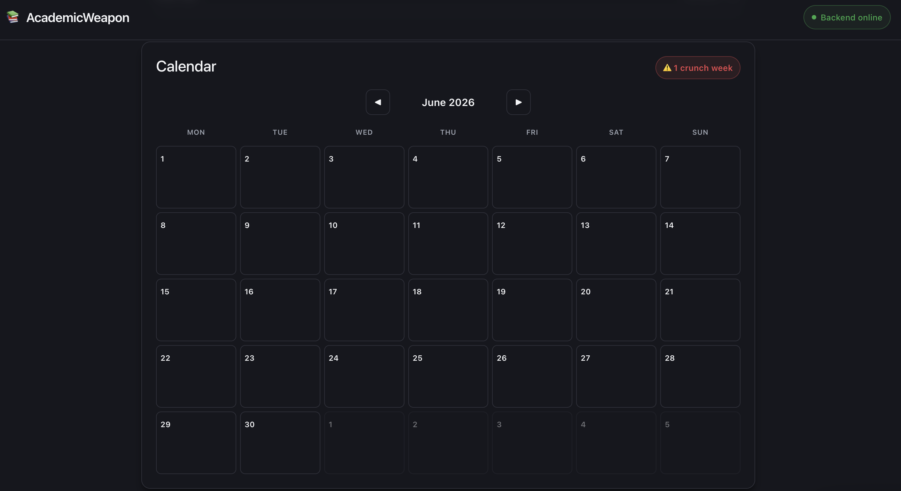

# AcademicWeapon

Turn messy syllabus PDFs into a plannable semester. Upload one or more course
syllabi, and AcademicWeapon uses an LLM to pull out every graded component —
assignments, quizzes, midterms, finals — with its **weight** and **deadline**,
then lays them out on a schedule, a workload heatmap, and a calendar you can
export to Google or Apple Calendar.



## Features

- **PDF → structured tasks.** Drop in one or more syllabus PDFs; the backend
  extracts text and an LLM returns strict JSON (title, course, weight, deadline,
  recurring) for each graded component. Grouped items like *"4 assignments = 32%"*
  are split into individual, evenly-weighted tasks.
- **Editable task table.** Sort by deadline / weight / course / title, filter by
  course, group by course, and edit any field by hand.
- **Suggested start dates.** A scheduler back-plans from each deadline using a
  simple effort estimate (≈1 hour per 1% of grade) so you know when to *begin*,
  not just when it's due.
- **Workload + crunch detection.** Tasks are bucketed by week and each week is
  classified `calm` / `busy` / `crunch` by total grade-weight due.
- **Calendar view.** A month grid drops each task on its due day and flags heavy
  days, so crunch weeks are visible at a glance.
- **Progress tracking.** Per-course completion measured by grade-weight (more
  meaningful than task count).
- **One-click exports.** Download your plan as **CSV** or **iCalendar (.ics)** for
  one-click sync with Google Calendar and Apple Calendar.
- **Survives refreshes.** Tasks persist in `localStorage`.





## Tech stack

| Layer    | Tech |
|----------|------|
| Frontend | React 19, TypeScript, Vite |
| Backend  | Node.js, Express 5, TypeScript (`tsx`) |
| PDF      | `pdf-parse` |
| LLM      | Groq API — `llama-3.3-70b-versatile` (OpenAI-compatible, JSON mode) |
| Uploads  | `multer` (in-memory) |

## Architecture

```
syllabus.pdf
   │  multipart upload
   ▼
[ Express  /api/parse-pdf ]
   │  pdf-parse → raw text
   ▼
[ Groq LLM  extractTasks() ]   strict JSON, temp 0.1
   │  Task[] { title, course, weight, deadline, recurring }
   ▼
[ React frontend ]
   schedule → workload → calendar → progress → CSV / .ics export
```

Pure logic (scheduling, calendar, workload, progress, exports) lives in
`frontend/src/lib/` with no React dependency, so it's reusable and testable on
its own.

## Getting started

### Prerequisites
- Node.js 18+
- A free [Groq API key](https://console.groq.com/keys)

### 1. Backend

```bash
cd backend
npm install
echo "GROQ_API_KEY=your_key_here" > .env
npm run dev          # starts on http://localhost:4000
```

Endpoints:
- `GET  /api/health` → `{ "status": "ok" }`
- `POST /api/parse-pdf` → multipart form field `file` (a PDF) → `{ tasks: Task[] }`

### 2. Frontend

```bash
cd frontend
npm install
npm run dev          # starts on http://localhost:5173
```

By default the frontend talks to `http://localhost:4000`. To point it at a
deployed backend, set `VITE_API_URL`:

```bash
echo "VITE_API_URL=https://your-backend.example.com" > .env.local
```

## Project structure

```
AcademicWeapon/
├── backend/
│   └── src/
│       ├── index.ts     # Express app, /api/health + /api/parse-pdf
│       ├── llm.ts        # Groq call + strict-JSON task extraction
│       └── types.ts      # shared Task shape
└── frontend/
    └── src/
        ├── App.tsx       # UI: upload, table, calendar, exports
        └── lib/
            ├── exports.ts   # CSV + iCalendar generation
            ├── schedule.ts  # suggested start dates
            ├── workload.ts  # weekly buckets + crunch levels
            ├── calendar.ts  # month grid
            └── progress.ts  # per-course completion
```

## The `Task` shape

```ts
type Task = {
  id: string;
  title: string;          // "Midterm 1", "Assignment 3"
  course?: string;        // "CS 246"
  deadline?: string;      // ISO "2026-03-15" when determinable
  weight?: number;        // % of final grade, 0–100
  effortHours?: number;   // estimate; user can override
  suggestedStart?: string;// filled by the scheduler
  recurring?: string;     // "weekly" if it repeats
  done?: boolean;         // checked off by the student
};
```

## License

MIT
